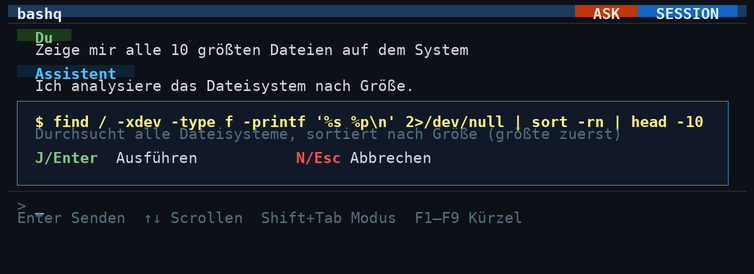
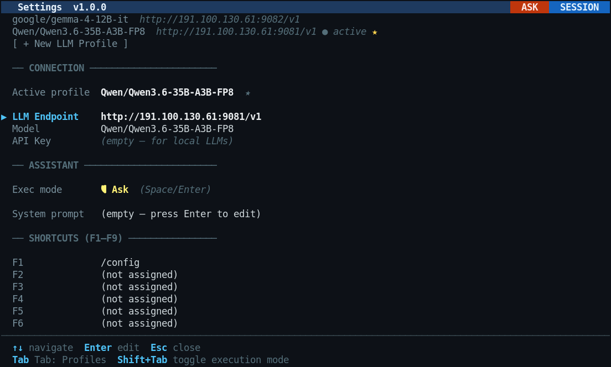

<div align="center">

# bashq

### Your terminal. Your LLM. Your command.

Type what you want. bashq turns plain language into shell commands,  
explains them, confirms, and runs them — all locally, all instantly.

[](LICENSE)
[](go.mod)
[](.)
[](../../releases)

**Sister project:** [winq](https://github.com/dev-core-busy/winq) — the Windows version

</div>

---



---

## What is bashq?

**bashq** is a minimalist TUI agent that lives entirely in your terminal.  
Describe what you need in plain English (or German, or Chinese) — bashq figures out the exact shell command chain, shows it to you with a clear explanation, and executes it on your confirmation.

> **Named after Q from Star Trek** — the omnipotent being of the Q Continuum who can answer any question and reshape reality with a thought. bashq brings that same effortlessness to your Linux command line.

No cloud. No account. No data leaving your machine. Just you, your terminal, and a local LLM.

---

## Why bashq?

| | |
|---|---|
| 🧠 **Plain language in, shell commands out** | Type *"find the 10 largest files on this system"* — not `find / -xdev -printf '%s %p\n' 2>/dev/null \| sort -rn \| head -10` |
| 👁 **You stay in control** | Every command is shown with a plain-language explanation before anything runs. One keypress to confirm, one to cancel. |
| 🔒 **100% local & private** | Runs on any OpenAI-compatible local LLM. Nothing ever leaves your machine. |
| 📡 **Auto-discovery** | Enter an IP — bashq scans common ports, detects the model, and sets up the profile in seconds. |
| ⚡ **Single static binary** | `chmod +x bashq && ./bashq` — no dependencies, no runtime, no install script. Works on any Linux system. |
| 💾 **Persistent sessions** | Restart and pick up exactly where you left off. Chat history and LLM context are preserved. |
| 🌍 **Multi-language UI** | German, English, Chinese — auto-detected from your system locale, switchable at runtime. |
| 🎛 **F1–F9 one-key macros** | Pre-configure your most-used queries as keyboard shortcuts. |

---

## Install in One Line

The binary lives in `~/.local/share/bashq/` — `/usr/local/bin/bashq` is a symlink to it. Auto-update writes to the binary in place; the symlink stays valid.

**x86-64 (most Linux desktops/servers):**
```bash
mkdir -p ~/.local/share/bashq && curl -fsSL https://github.com/dev-core-busy/bashq/releases/latest/download/bashq-linux-amd64 -o ~/.local/share/bashq/bashq && chmod +x ~/.local/share/bashq/bashq && sudo ln -sf ~/.local/share/bashq/bashq /usr/local/bin/bashq
```

**ARM64 (Raspberry Pi 4/5):**
```bash
mkdir -p ~/.local/share/bashq && curl -fsSL https://github.com/dev-core-busy/bashq/releases/latest/download/bashq-linux-arm64 -o ~/.local/share/bashq/bashq && chmod +x ~/.local/share/bashq/bashq && sudo ln -sf ~/.local/share/bashq/bashq /usr/local/bin/bashq
```

That's it. Run `bashq` from anywhere.

> **No sudo?** Link into `~/.local/bin` instead:
> ```bash
> mkdir -p ~/.local/share/bashq ~/.local/bin
> curl -fsSL https://github.com/dev-core-busy/bashq/releases/latest/download/bashq-linux-amd64 -o ~/.local/share/bashq/bashq && chmod +x ~/.local/share/bashq/bashq && ln -sf ~/.local/share/bashq/bashq ~/.local/bin/bashq
> ```
> Make sure `~/.local/bin` is in your `PATH` (`echo 'export PATH="$HOME/.local/bin:$PATH"' >> ~/.bashrc && source ~/.bashrc`).

> **Already running bashq?** Type `/setup` inside the app — it installs or removes itself with one keypress. Auto-update is built in and can be toggled in `/config`.

### Manual download

Grab the binary for your architecture from the **[Releases](../../releases)** page and run it directly:

```bash
chmod +x bashq-linux-amd64 && ./bashq-linux-amd64
```

### 2. Connect your LLM

On first start, bashq connects to `http://localhost:9081/v1` (default).  
Open `/config` in the input field — or let bashq find your LLM automatically:

1. In the input field, type `/config` and press Enter
2. Navigate to **LLM PROFILES → [ + New LLM Profile ]**
3. Enter your LLM server's IP address
4. bashq scans ports `11434 1234 8080 8000 9081 7860 5000 3000` automatically
5. Select a model from the list — done ✓

### 3. Ask anything

```
> Show me which processes are using the most memory
> List all failed systemd services
> Find files larger than 1 GB modified in the last 7 days
> What's eating my disk space in /var?
> Set up a daily cron job to clean /tmp
```

---

## Compatible LLM Servers

Any **OpenAI-compatible** local server works out of the box:

| Server | Default port | Notes |
|--------|-------------|-------|
| [Ollama](https://ollama.com) | 11434 | Recommended — easiest setup |
| [LM Studio](https://lmstudio.ai) | 1234 | Great GUI for model management |
| [vLLM](https://github.com/vllm-project/vllm) | 8000 | High-throughput production server |
| [llama.cpp server](https://github.com/ggerganov/llama.cpp) | 8080 | Lightweight, runs anywhere |
| [Jan](https://jan.ai) | 1234 | Cross-platform desktop app |
| Any OpenAI-compatible API | any | Including cloud providers |

> **Recommended models:** Qwen3, Llama 3.1/3.2, Mistral, DeepSeek-Coder, Gemma 2

---

## Settings & Configuration



Type `/config` to open the settings editor.

### LLM Profiles

Save multiple LLM endpoints and switch between them instantly.  
Mark one as **preferred** (`P`) — bashq health-checks it on startup and suggests the next available profile if it's unreachable.

### Execution Modes

| Mode | Behaviour |
|------|-----------|
| **ASK** (default) | Shows command + explanation, waits for confirmation |
| **AUTO** | Executes commands immediately — for repetitive workflows |

Toggle with `Shift+Tab` from anywhere. The title bar always shows the active mode.

### Session Persistence

bashq saves your entire conversation and LLM context on exit — including tool call history.  
Toggle with `Alt+S` or in `/config → SESSIONS`. The title bar shows a 💾 SESSION badge when active.

---

## Keyboard Reference

| Key | Action |
|-----|--------|
| `Enter` | Send message / confirm command |
| `J` / `Enter` | Confirm pending command |
| `N` / `Esc` | Cancel pending command |
| `↑ / ↓` | Scroll history / navigate lists |
| `Shift+Tab` | Toggle ASK ↔ AUTO execution mode |
| `Alt+S` | Toggle session persistence on/off |
| `F1–F9` / `Alt+1–9` | Custom one-key shortcuts (configure in `/config`) |
| `Tab` | Switch between profile list and settings in `/config` |
| `/` | Open command autocomplete |
| `Ctrl+C` | Cancel running LLM request or command |
| `Ctrl+Q` | Save session and quit |

## Slash Commands

Type `/` for autocomplete with descriptions.

| Command | What it does |
|---------|-------------|
| `/install` | Install software packages |
| `/update` | Update the system |
| `/status` | Full system overview |
| `/disk` | Disk space analysis |
| `/memory` | Memory usage breakdown |
| `/network` | Network interfaces & connectivity |
| `/services` | Manage systemd services |
| `/logs` | Recent system log entries |
| `/config` | Open settings editor |
| `/setup` | Install bashq system-wide (or remove — acts as a toggle) |
| `/activities` | Show command history with timestamps |
| `/clear` | Clear chat history and start fresh |
| `/help` | Show keyboard shortcuts and tips |

---

## Building from Source

Requires **Go 1.22+** — produces a fully static binary (~7 MB), no libc dependency.

```bash
git clone https://github.com/dev-core-busy/bashq.git
cd bashq
bash build.sh          # → ./bashq  (static, CGO_ENABLED=0)
# or for a quick dev build:
go build -o bashq .
```

```bash
go vet ./...           # static analysis
go build ./...         # compile-check without producing a binary
```

---

## Files

| Path | Purpose |
|------|---------|
| `~/.config/bashq/config.json` | Settings (LLM profiles, shortcuts, preferences) |
| `~/.config/bashq/activities.log` | Full history of every query, response and command |
| `~/.config/bashq/session.json` | Saved session state (chat + LLM context) |

All files are human-readable JSON / plain text. Delete any of them to reset that component.

---

## The Name

**bash** + **q** — the Q Continuum of shell interfaces.

In Star Trek, Q is an omnipotent entity who knows everything, can do anything, and never needs to look anything up. That's the energy bashq brings to your command line: ask it anything about your system, and it handles the rest.

---

## Sister Project

**[winq](https://github.com/dev-core-busy/winq)** — the Windows sibling.  
Same concept, same architecture, same local-LLM philosophy — built for PowerShell and Windows instead of bash and Linux.

---

## License

MIT — see [LICENSE](LICENSE).

---

<div align="center">

**[⭐ Star this repo](../../stargazers)** if bashq saves you time — it helps others find it.

*Runs entirely on your machine. Your queries never leave your terminal.*

</div>
